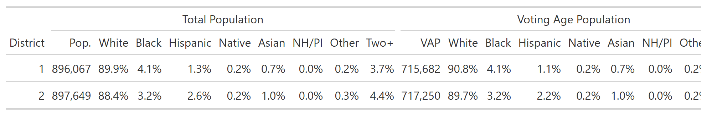
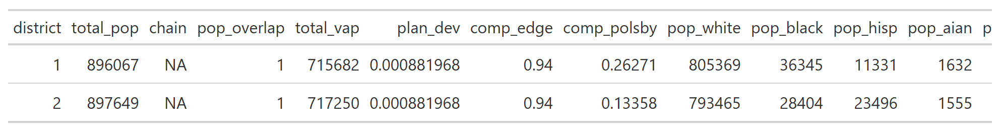

<!-- README.md is generated from README.Rmd. Please edit that file -->

# rict 

<!-- badges: start -->

[](https://github.com/christopherkenny/rict/actions/workflows/R-CMD-check.yaml)
<!-- badges: end -->

`rict` provides clean, formatted [`gt`](https://gt.rstudio.com/) tables
to accompany redistricting maps. It is designed to complement
[`redist`](https://alarm-redist.org/redist/) and
[`redistmetrics`](https://alarm-redist.org/redistmetrics/), but works
with any electoral or demographic data.

## Installation

You can install the development version of `rict` from
[GitHub](https://github.com/christopherkenny/rict) with:

``` r
pak::pak('christopherkenny/rict')
```

## Overview

`rict` provides a family of `rict_*()` functions, each producing a
formatted table for a specific redistricting quantity:

| Function | Description |
|----|----|
| `rict()` | District-level summary from a `redist_map` or `redist_plans` |
| `rict_demographics()` | Population and voting-age population by race/ethnicity |
| `rict_elections()` | Democratic vote shares across electoral contests |
| `rict_compactness()` | Common compactness scores (Polsby-Popper, Reock, etc.) |
| `rict_population()` | Population and deviation from the ideal district size |
| `rict_splits()` | Number of administrative units split by the plan |
| `rict_contiguity()` | Number of contiguous pieces per district |

Additional helpers embed visuals directly inside a `gt` table:

| Function                | Description                      |
|-------------------------|----------------------------------|
| `gt_plot_sf()`          | Embed district map thumbnails    |
| `gt_plot_compactness()` | Embed compactness geometry plots |

## Examples

### Demographics

`rict_demographics()` summarizes total population and voting-age
population by race/ethnicity across districts.

``` r
library(rict)
rict_demographics(map = wv, plan = wv$cd_2020)
```



### Compactness

`rict_compactness()` tabulates common geometric compactness scores for
each district.

``` r
rict_compactness(map = wv, plan = wv$cd_2020)
```


### Elections

`rict_elections()` shows Democratic vote shares for each electoral
contest, along with normal partisan averages.

``` r
rict_elections(map = wv, plan = wv$cd_2020)
```


### Plans

For a `redist_plans` object, `rict()` formats a single draw as a table.

``` r
data(wv_plans)
rict(wv_plans, 'cd_2020')
```


