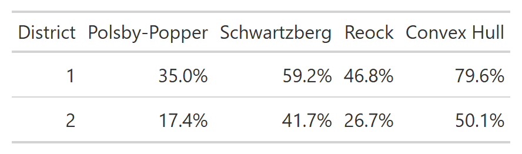

# rict

`rict` provides clean, formatted [`gt`](https://gt.rstudio.com/) tables
to accompany redistricting maps. It is designed to complement
[`redist`](https://alarm-redist.org/redist/) and
[`redistmetrics`](https://alarm-redist.org/redistmetrics/), but works
with any electoral or demographic data.

## Installation

You can install the development version of `rict` from
[GitHub](https://github.com/christopherkenny/rict) with:

``` r
pak::pak('christopherkenny/rict')
```

## Overview

`rict` provides a family of `rict_*()` functions, each producing a
formatted table for a specific redistricting quantity:

| Function                                                                                  | Description                                                  |
|-------------------------------------------------------------------------------------------|--------------------------------------------------------------|
| [`rict()`](http://christophertkenny.com/rict/reference/rict.md)                           | District-level summary from a `redist_map` or `redist_plans` |
| [`rict_demographics()`](http://christophertkenny.com/rict/reference/rict_demographics.md) | Population and voting-age population by race/ethnicity       |
| [`rict_elections()`](http://christophertkenny.com/rict/reference/rict_elections.md)       | Democratic vote shares across electoral contests             |
| [`rict_compactness()`](http://christophertkenny.com/rict/reference/rict_compactness.md)   | Common compactness scores (Polsby-Popper, Reock, etc.)       |
| [`rict_population()`](http://christophertkenny.com/rict/reference/rict_population.md)     | Population and deviation from the ideal district size        |
| [`rict_splits()`](http://christophertkenny.com/rict/reference/rict_splits.md)             | Number of administrative units split by the plan             |
| [`rict_contiguity()`](http://christophertkenny.com/rict/reference/rict_contiguity.md)     | Number of contiguous pieces per district                     |

Additional helpers embed visuals directly inside a `gt` table:

| Function                                                                                      | Description                      |
|-----------------------------------------------------------------------------------------------|----------------------------------|
| [`gt_plot_sf()`](http://christophertkenny.com/rict/reference/gt_plot_sf.md)                   | Embed district map thumbnails    |
| [`gt_plot_compactness()`](http://christophertkenny.com/rict/reference/gt_plot_compactness.md) | Embed compactness geometry plots |

## Examples

### Demographics

[`rict_demographics()`](http://christophertkenny.com/rict/reference/rict_demographics.md)
summarizes total population and voting-age population by race/ethnicity
across districts.

``` r
library(rict)
rict_demographics(map = wv, plan = wv$cd_2020)
```


### Compactness

[`rict_compactness()`](http://christophertkenny.com/rict/reference/rict_compactness.md)
tabulates common geometric compactness scores for each district.

``` r
rict_compactness(map = wv, plan = wv$cd_2020)
```



### Elections

[`rict_elections()`](http://christophertkenny.com/rict/reference/rict_elections.md)
shows Democratic vote shares for each electoral contest, along with
normal partisan averages.

``` r
rict_elections(map = wv, plan = wv$cd_2020)
```


### Plans

For a `redist_plans` object,
[`rict()`](http://christophertkenny.com/rict/reference/rict.md) formats
a single draw as a table.

``` r
data(wv_plans)
rict(wv_plans, 'cd_2020')
```


